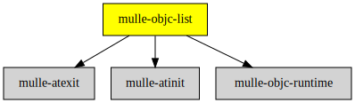

# mulle-objc-list

#### 📒 Lists mulle-objc runtime information contained in executables.

`mulle-objc-list` is a [mulle-objc](//github.com/mulle-objc) tool.
It's useful when developing mulle-objc projects. It loads a shared library and
dumps the mulle-objc load information contained within, for instance classes
or categories. The output is as [CSV, euro-style](//en.wikipedia.org/wiki/Comma-separated_values).


| Release Version                                       | Release Notes
|-------------------------------------------------------|--------------
|  [](//github.com/mulle-objc/mulle-objc-list/actions) | [RELEASENOTES](RELEASENOTES.md) |


## Usage

```
usage: mulle-objc-list [options] [command] [libraries] <binary>

   The binary is listed. The preceeding libraries are
   explicitly loaded but their contents aren't listed.
   Implicitly loaded libraries by binary are listed.

Options:
   -e      : emit dependencies sentinel field
   -l <id> : specify loader-class id for -d (default is 0x58bd58d3)   -v      : verbose

Commands:
   -c      : list classes and categories
   -d      : list classes and categories as +dependencies. Skips loaders
   -i      : dump loadinfo version information
   -m      : list methods (default)
   -M      : list also root -methods as +methods
   -t      : terse list methods (coverage like)
   -T      : terse list methods with root -methods also as +methods
```


## mulle-objc-list

`mulle-objc-list` loads a shared library or executable and prints a CSV list of all
class and categories or methods it finds. The binary must have been
compiled with **mulle-clang**.


### Class/Category List

For each class or category a line is printed. The format is:

`classid;classname;categoryid;categoryname`

Index | Column name  | Description
------|--------------|---------------------------------
1     | classid      |  the id of the class, 8 hex characters
2     | classname    |  the name of the class
3     | categoryid   |  optional: the id of the category
4     | categoryname |  optional: the name of the category


### Method List

Each line represents one exported method. The format is:

`classid;classname;categoryid;categoryname;methodid;+/-name;variadic;bits;tpe`

> This has changed in 8.0.0


Index | Column name  | Description
------|--------------|---------------------------------
1     | classid      |  the id of the class, 8 hex characters
2     | classname    |  the name of the class
3     | categoryid   |  optional: the id of the category
4     | categoryname |  optional: the name of the category
5     | methodid     |  the id of the method
6     | name         |  methodname like `takeValue:forKey:`  with +/- prefix
7     | variadic     |  either `...` or empty
8     | bits         |  bits as hex value
9     | type         |  decoded type of method, separated by comma
                     |  (may contain ';')

The intended use is to produce test skeleton code from this information.


### Terse Method List

Each line represents one exported method. The format is:

`classid;classname;categoryid;categoryname;methodid;+/-name`

Index | Column name  | Description
------|--------------|---------------------------------
1     | classid      |  the id of the class, 8 hex characters
2     | classname    |  the name of the class
3     | categoryid   |  optional: the id of the category
4     | categoryname |  optional: the name of the category
5     | methodid     |  the id of the method
6     | name         |  methodname like `takeValue:forKey:` with +/- prefix


This is the same format as the runtime coverage output, if you remove the first
two columns from the output. Then subtracting the modified coverage from this
list, would show you all unused methods.


### Objects Info

Each line represents a linked `-o` file with classes or categories.

`path;runtime-version;foundation-version;user;optilevel;bits`


Index | Column name  | Description
------|--------------|---------------------------------
1     | path         | source of compiled .o file
2     | runtime      | version of the runtime the .o file was compiled
3     | foundation   | version of the foundation the .o file was compiled
4     | user         | user supplied version during compilation
5     | optilevel    | optimization level of the compiled .o file
6     | bits         | load info bits as hex


Can be useful to find mixed-in old .o files


### You are here




## Requirements

|   Requirement         | Release Version  | Description
|-----------------------|------------------|---------------
| [mulle-objc-runtime](https://github.com/mulle-objc/mulle-objc-runtime) |  [](https://github.com/mulle-objc/mulle-objc-runtime/actions/workflows/mulle-sde-ci.yml) | ⏩ A fast, portable Objective-C runtime written 100% in C11
| [mulle-atinit](https://github.com/mulle-core/mulle-atinit) |  [](https://github.com/mulle-core/mulle-atinit/actions/workflows/mulle-sde-ci.yml) | 🤱🏼 Compatibility library for deterministic initializers
| [mulle-atexit](https://github.com/mulle-core/mulle-atexit) |  [](https://github.com/mulle-core/mulle-atexit/actions/workflows/mulle-sde-ci.yml) | 👼 Compatibility library to fix atexit


## Add

### Add as an individual component

Use [mulle-sde](//github.com/mulle-sde) to add mulle-objc-list to your project:

``` sh
mulle-sde add github:mulle-objc/mulle-objc-list
```

To only add the sources of mulle-objc-list with dependency
sources use [clib](https://github.com/clibs/clib):


``` sh
clib install --out src/mulle-objc mulle-objc/mulle-objc-list
```

Add `-isystem src/mulle-objc` to your `CFLAGS` and compile all the sources that were downloaded with your project.


## Install

### Install with mulle-sde

Use [mulle-sde](//github.com/mulle-sde) to build and install mulle-objc-list and all dependencies:

``` sh
mulle-sde install --prefix /usr/local \
   https://github.com/mulle-objc/mulle-objc-list/archive/latest.tar.gz
```

### Manual Installation

Install the [Requirements](#Requirements) and then
install **mulle-objc-list** with [cmake](https://cmake.org):

``` sh
cmake -B build \
      -DCMAKE_INSTALL_PREFIX=/usr/local \
      -DCMAKE_PREFIX_PATH=/usr/local \
      -DCMAKE_BUILD_TYPE=Release &&
cmake --build build --config Release &&
cmake --install build --config Release
```


## Author

[Nat!](https://mulle-kybernetik.com/weblog) for Mulle kybernetiK  


