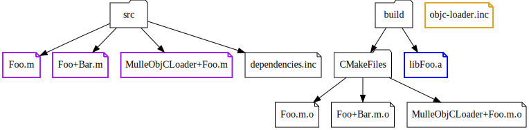

# How to make an optimizable static library

The library has a fixed name. Lets's assume it's name is "Foo", on OS X the
static library filename would be `libFoo.a`. "lib" is a OS specific prefix
prependend to the name. and ".a" is the OS specific file extension.


There are two specific requirements to make a library "Foo" optimizable. It must contain a `MulleObjCLoader+Foo.o` object file and a `objc-loader.inc` header:




### Must contain `MulleObjCLoader+Foo.o`

Each library must contain a category of the class **MulleObjCLoader** that is named
like the library. For library "Foo" the category name is `MulleObjCLoader( Foo)`.
The category must reside in a single source filename named `MulleObjCLoader+Foo.m`.

> It is also possible to use ' ', '_', '-' as delimiters between the class name and the category name.

The compiled form is expected to be either `MulleObjCLoader+Foo.o` or
`MulleObjCLoader+Foo.m.o`. That's how it is searched in the library archive.

This category only has one method called `+dependencies`. This method does
nothing else, but only returns the contents of `objc-loader.inc` as a static C array of `struct  _mulle_objc_dependencies` terminated by a zero values entry.


```
#import <MulleObjC/MulleObjC>


@implementation MulleObjCLoader( Foo)

+ (struct _mulle_objc_dependency *) dependencies
{
   static struct _mulle_objc_dependency   dependencies[] =
   {

#include "objc-loader.inc"

      { MULLE_OBJC_NO_CLASSID, MULLE_OBJC_NO_CATEGORYID }
   };

   return( dependencies);
}

@end
```

### Must provide `include/Foo/objc-loader.inc`

Each library must make a file called `objc-loader.inc` available. It is placed
into the headers directory under the name of the library:


The file `objc-loader.inc` contains dependency information for the required base libraries. It also contains a list of all classes and categories defined by this library.

> See: [Understanding load order of classes and categories](https://github.com/mulle-objc/mulle-objc-runtime/wiki/Understanding---load-order-of-classes-and-categories)

Together with the template for generating a MulleObjCLoader category, the optimizer is now able to replace `MulleObjCLoader+Foo.o` file with a generated version.


### Must not contain two MulleObjCLoader categories

The optimizer checks, that there isn't more than one category on `MulleObjCLoader`. If it finds two or more, the whole library is deemed unoptimizable.


## How to generate `dependencies.inc`

It is assumed, that you generate your library project files using **mulle-sde init**.
Then `src/objc-loader.inc` will be created for your via cmake.

Otherwise check out `mulle-objc-loader-tool` provided by the **mulle-objc-list** project.


