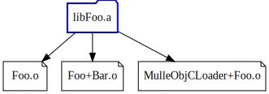
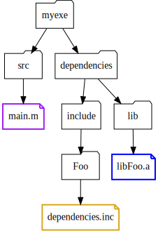
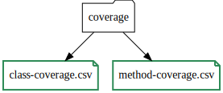
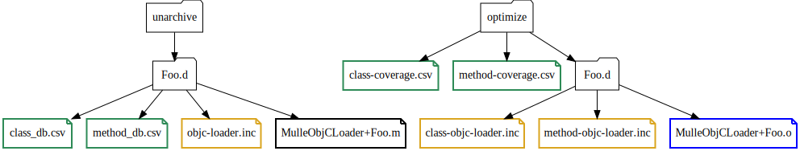
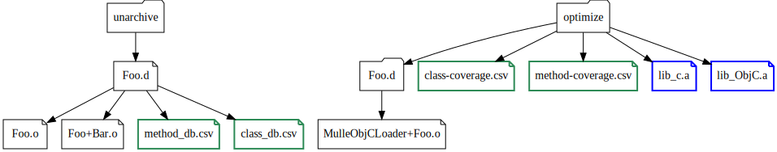

# How the optimizer works

The **mulle-objc** static library optimizer uses coverage information generated by an executable to strip out unused classes and categories. There are some limits to this:

* the optimization "granularity" is the .o file. For example: if you have two classes in an .o file and only one gets used, the optimizer can not optimize the second class away
* the optimizer can only optimize .o files contained in libraries. The .o files of an executable can not be optimized (place them in a library)

All current linkers need special flags to link Objective-C code. Otherwise classes and categories will get stripped from the resulting executable. These flags are

OS / Linker      | Flag
-----------------|-----------------------------
OS X             | -all_load
Linux            | -Wl,--whole-archive
FreeBSD          | -Wl,--whole-archive
Windows          | /OPT:NOREF /OPT:NOICF (???)


The optimizer uses this behaviour for the optimization. It takes a selection of static libraries from and reduces them to two libraries. These libraries are then linked against the executable, instead of the original selection:

File                        | Description
----------------------------|-----------------------------------
`lib_c.a`                   | A static library that is linked like C code. The linker will only keep referenced C symbols. Objective-C code will be removed.
`lib_ObjC.a`                | A static library that needs to be fully linked like any Objective-C code (using -all_load or some such)

> Both libraries together contain all the .o files from the unoptimized libraries.
> A large `lib_ObjC.a` and a small `lib_c.a` shows limited optimization potential.
>
> Hint: If you introspect all classes and methods in your code during coverage,
> the optimization potential is pretty much guaranteed to be zero.


## Example with a library named "Foo"

Assume you have a library **Foo** that contains two source files
`Foo.m` and `Foo+Bar.m`. To make it [optimizable](OPTIMIZABLE.md) it also contains a loader category in `src/MulleObjCLoader+Foo.m` and the accompanying `src/dependencies.inc` file.

When you build your project, the result will be `libFoo.a`, that consists of three object files `Foo.o`,`Foo+Bar.o`, `MulleObjCLoader+Foo.o`




When you use this library in an executable project, you'd reference only the header files  and the library. It is assumed that inc files and header have been installed into `dependencies` (most likely with [mulle-bootstrap](https://github.com/mulle-nat/mulle-bootstrap)).  So minimally it will look somewhat like this:




### 1. mulle-objc-unarchive unpacks the static libraries

**mulle-objc-unarchive** is used to prepare the library for optimization. It takes its input from `dependencies` and unpacks each library into its own `.d` folder. In our case that is `Foo.d`.


The loader object file `MulleObjCLoader+Foo.o` contained in `libFoo.a` has been removed. The information from `dependencies.inc` is used to create a number of intermediate files:


File                      | Description
--------------------------|-----------------------------------
`loader-dependencies.inc` | C file that contains the dependencies to Objective-C base libraries (as they are represented by their MulleObjCLoader categories)
`class-db.csv`            | List of classes contained in `libFoo.a`
`method-db.csv`           | List of all methods contained in `libFoo.a`
`MethodObjCLoader+Foo.m`  | A partially complete, generated loader for this library


The generated loader will look like this:

```
#include <MulleObjC/MulleObjC.h>


@implementation MulleObjCLoader( Foo)

+ (struct _mulle_objc_dependency *) dependencies
{
   static struct _mulle_objc_dependency   dependencies[] =
   {
#include "loader-dependencies.inc"
#include "class-dependencies.inc"
#include "category-dependencies.inc"
      { MULLE_OBJC_NO_CLASSID, MULLE_OBJC_NO_CATEGORYID }
   };

   return( dependencies);
}

@end
```

As you can see `loader-dependencies.inc` has already been generated. The other two files will be supplied by the optimizer during the next steps.

### 2. Generate coverage information by running the executable

> Read [COVERAGE](COVERAGE.md) for more background information about coverage files.

The executable **myexe** is a **mulle-objc** executable that links against `libFoo.a` and minimally also against `libMulleObjC.a`. When you run myexe with the environment variable **MULLE_OBJC_COVERAGE** set to YES:

```
MULLE_OBJC_COVERAGE=YES ./build/myexe
```

it will produce two coverage files `class-coverage.csv` and `method-coverage.csv`:



Assume the generated coverage uses class `Foo.o` but does not include any methods contained in `Foo+Bar.o`. Then `Foo+Bar.o` could be optimized away.


### 3. mulle-objc-optimize creates a custom loader

The two coverage files `class-coverage.csv` and `method-coverage.csv` are now copied and slightly modified by  **mulle-objc-optimize**. Then they are used to filter the `method_db.csv` and `class_db.csv` tables.



The result of this pass are two new files in the `Foo.d` folder:

File                        | Description
----------------------------|-----------------------------------
`class-dependencies.inc`    | C file that contains the classes of libFoo.a that will be member of the unoptimizable library (`lib_ObjC.a`)
`category-dependencies.inc` | C file that contains the categories of libFoo.a that will be member of the unoptimizable library (`lib_ObjC.a`)

A new `MulleObjCLoader+Foo.o` is now compiled. It contains only the dependencies for those classes and categories, that have been referenced by the coverage files.

Assume the generated coverage uses class `Foo.o` but does not include any methods contained in `Foo+Bar.o`. Then `class-dependencies.inc` would reference `Foo.o`, but `category-dependencies.inc` would be empty.

### 4. mulle-objc-optimize creates new libraries

Now with all required objects available, the coverage information is used a second time on the `method_db.csv` and `class_db.csv` tables to construct the resulting `lib_c.a` and `lib_ObjC.a`.  All .o files of referenced methods and classes, will end up in `lib_ObjC.a`. The rest is stored in `lib_c.a`



All MethodObjCLoader categories will be part of `lib_ObjC.a`.

Assume the generated coverage uses class `Foo.o` but does not include any methods contained in `Foo+Bar.o`. Then `lib_ObjC.a` would contain `Foo.o` and `lib_c.a` would contain `lib_c.a`.


### 5. Relink myexe

Now relink **myexe** with `lib_c.a` and `lib_ObjC.a` and _none_ of the libraries contained in `dependencies/lib`. The result will be a much smaller executable.


Executable projects created by **mulle-foundation-init** and **mulle-objc-init**
are already configured to use coverage optimization. Build them using
`mulle-build -DUSE_OBJC_COVERAGE=ON` and step 1,3,4,5 are taken care off for you.
You just need to provide the coverage information.


